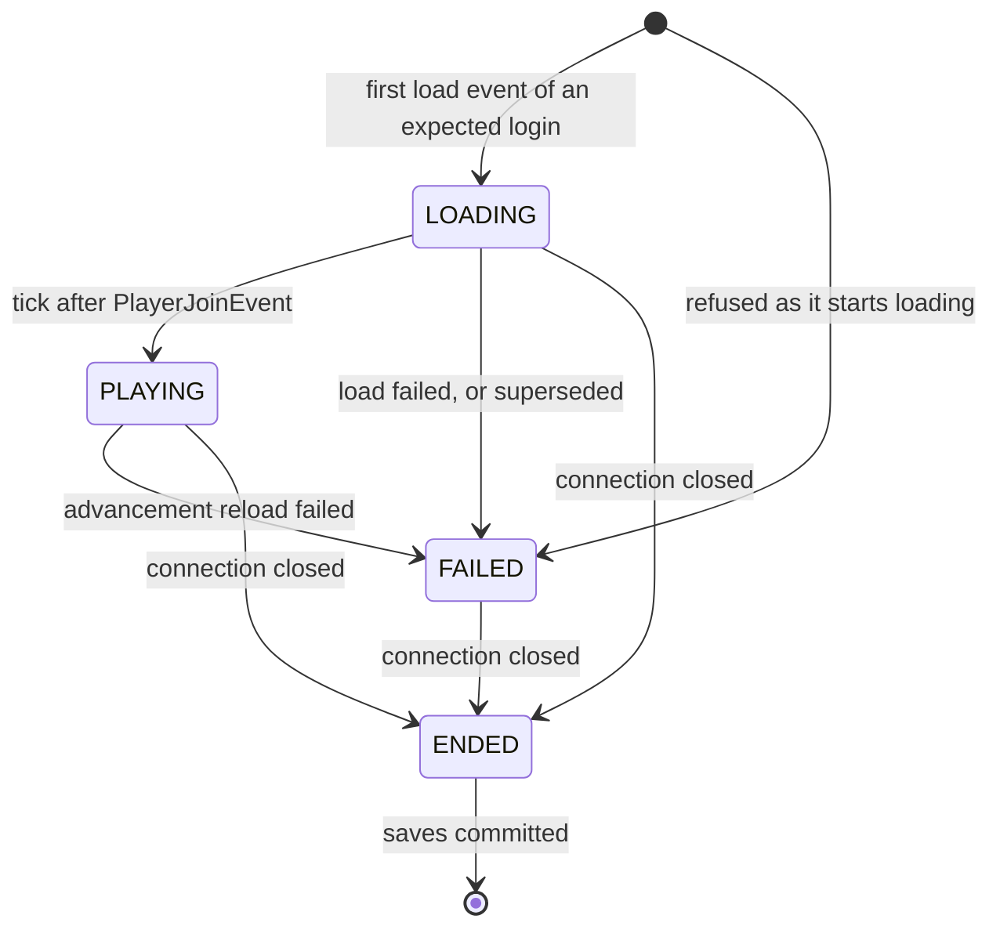
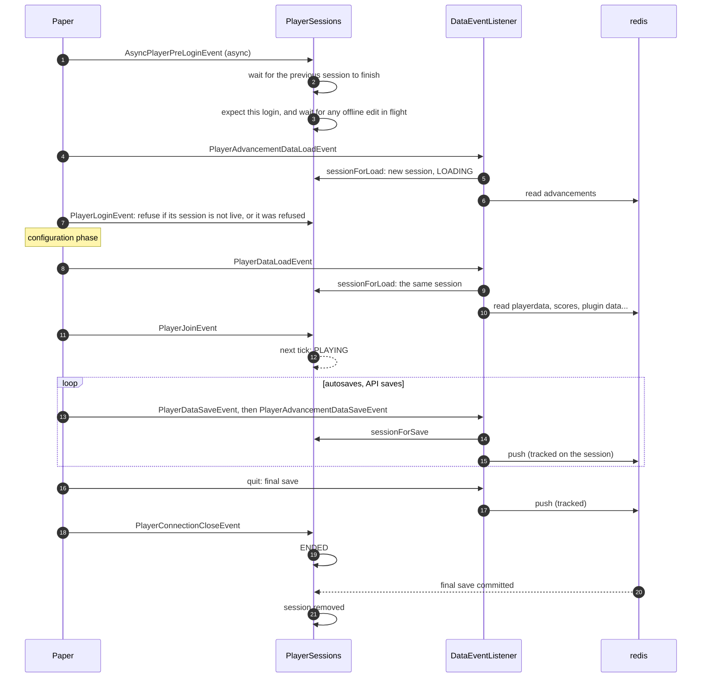
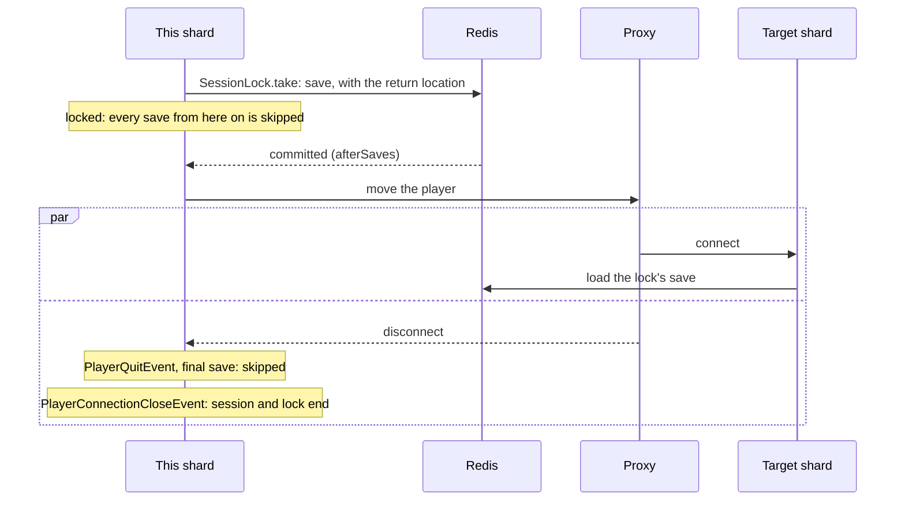
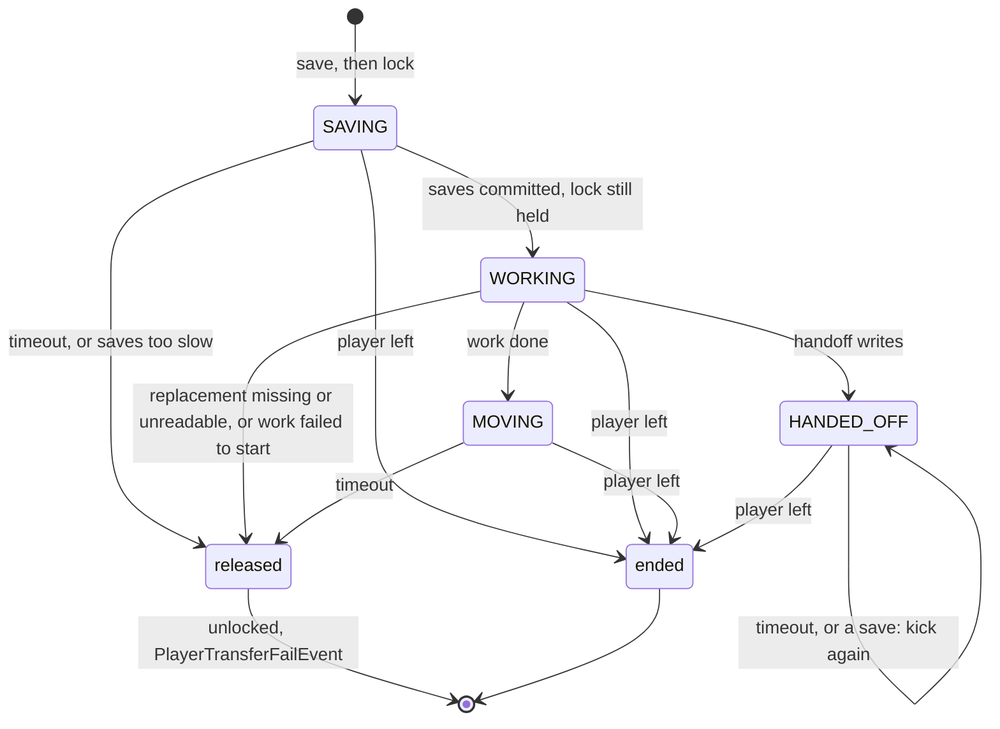

# Player data lifecycle: design

How MonumentaRedisSync tracks a player on one shard, and decides when their data may be loaded
from redis and saved back to it. What other plugins can rely on is summarized in the
[README](README.md#how-player-data-is-saved-and-loaded); this document explains how it is
achieved. Everything here is within one shard.

## The problem

A shard loads a player's data from redis when they log in, and saves it back while they play
and when they leave. The design has to ensure that a player always loads their newest save, and
that nothing ever saves stale or partial data over it. Three things make that hard:

- **Saves commit later.** A save hands commands to redis and returns at once. Redis may take
  100ms or more to run them, and a reconnect, a transfer or a shutdown can arrive in between.
- **Connections overlap.** A player can log in again before their previous connection has
  closed. Plugins can also hold on to an old `Player` object, or construct fake players that fire
  load events but never disconnect.
- **The server's events are not a clean lifecycle.** Kicks before the game connection exists do
  nothing. The connection close event carries only a UUID, and may fire off the main thread.

## Data in redis

Each player's data is a set of history lists, newest first: playerdata (NBT), advancements,
scores, plugin data, content, and a history line naming who saved it. Every full save pushes one
entry onto every list, so index *n* of every list is the same save. Rollback, stash put and
loadFromPlayer read all lists at one index, so the lists must stay aligned. Position and world
are kept per shard and world in a hash, outside the history.

A save is two transactions on two connections: playerdata over a connection with byte values,
and everything else over a string connection. Each connection is FIFO, but the two are not
ordered against each other.

## Components

| Class | Role |
|---|---|
| `PlayerSession` | One connection: its state, the data cached from redis, its saves that have not committed, and its lock |
| `PlayerSessions` | The registry of sessions. Handles login and disconnect, and decides whether a load event may load and a save event may save |
| `SessionLock` | Held while a player's data moves elsewhere (a transfer, or a data handoff). Takes itself, times out, waits for saves to commit, releases |
| `DataEventListener` | Does the loading and saving: Paper's load and save events, to and from redis |
| `LockedPlayerListener` | Cancels the common interactions of a locked player, so little happens that the moving save would miss |
| `MonumentaRedisSyncAPI` | `sendPlayer`, stash, rollback, loadFromPlayer and offline edits, built on the above |

`PlayerSessions` and `DataEventListener` split *whether* from *how*. Every load and save event
first asks `PlayerSessions` which session it belongs to (`sessionForLoad`, `sessionForSave`). A
save goes ahead only into a session that can save, and a load only into a live one (loading or
playing).

The design rests on two small state machines: a session's, which follows the connection, and a
lock's, which follows the player's data while it moves.

## Sessions

A `PlayerSession` covers one connection, from its first load event until Paper's
`PlayerConnectionCloseEvent`. It belongs to one `Player` object, and Paper creates a new one per
connection. Events are matched to their session by object identity, not UUID. A plugin holding a
`Player` from an earlier connection therefore cannot save its stale state over the current
connection, or lock it. Waiting for saves, by contrast, goes by UUID, so that a login can wait
for the previous connection's.

- **LOADING.** Not saved yet: other plugins load their own state in their join handlers, and a
  save before then would write their empty state. Saving starts on the tick after PlayerJoinEvent,
  since other MONITOR handlers may still run after this plugin's.
- **PLAYING.** Saved, unless locked.
- **FAILED.** The load failed, the connection was refused, or a newer login superseded it while it
  was still loading. Never saved, because that would put partial data over the real thing; the
  player is refused at PlayerLoginEvent if it is still to come, and kicked otherwise.
- **ENDED.** The connection has closed. An ended session stays registered until every save it
  made has committed, so that a reconnect can wait for it, and is then removed.

The lock is separate from the state, since a transfer may start during the join tick, while the
session is still loading. A session is saved only when it is PLAYING and not locked
(`PlayerSession.canSave`).

A login always gets a new session. Everything the plugin caches for the player (plugin data,
shard data, content data) lives on the session, so it disappears when the connection closes.

### Which connections get a session

Only logins that pass `AsyncPlayerPreLoginEvent` get a session that is kept. Any other load event
gets one that is not: it loads as usual, but nothing saves it, and nothing ends it. That covers
NPC plugins' fake players, which fire load events but never a close event, so a kept session of
theirs would never end.

Pre-login records the login as *expected* for a minute. Its first load event takes the
expectation and stores the session. A login that drops in between leaves no close event, so the
expectation expires rather than lingering until some fake player with the UUID takes it and
starts a session that never ends, locking the real player out.

### Which connection a close belongs to

The close event carries only a UUID. That is ambiguous only when two connections for one account
are here at once. Velocity never does that, but a proxy bug could. `connectionClosed` attributes
each close:

1. A second connection that starts loading while the account already has a session is refused.
   Once PlayerLoginEvent has refused it too, the next close is taken as its. Fake players are
   refused the same way, but never reach PlayerLoginEvent, so no close is expected of them. This
   check comes first, or the established session's own close would be taken for the refused one's.
2. Paper takes a player out of the game before their own connection's close fires. So if the
   session's player is still in the game, the close is another connection's, and is ignored.
3. Otherwise the session ends.

The one case this cannot resolve is a second connection that drops before loading while the
first is still configuring: its close ends the first connection's session. The first connection
then has no live session: its playerdata load finds its own ended session, or none at all, and
does not load into a kept one, so it is kicked at join for having no session. The worst case is
a refused login, never unsaved play.

## A connection's life

A player reconnecting straight after leaving can reach pre-login before their previous
connection has closed, or before its final save has committed. Loading then would hand them the
save before last, which they would then save back over their progress. So pre-login, on its
async thread (the one place a login can block), waits up to `TIMEOUT_SECONDS` for the previous
session's `finished()`: closed, with every save it made committed. A login that times out is
refused.

If the previous connection is still open, because the client dropped and came back before the
server noticed, the newest login wins, as in vanilla. Pre-login supersedes the old connection
before anything loads, and then waits for it as above. A playing connection is kicked, which
saves it. One still loading cannot be kicked during configuration, so it is failed instead: it
never saves, and is kicked when it joins. If it never gets that far, as with a dead client stuck in
configuration, it closes only when Paper times it out, and the new login is refused if that
takes longer than `TIMEOUT_SECONDS`.

## Saves, and waiting for them

Every write of a player's data made through their session is tracked on it: their saves, and a
handoff's write. `savesCommitted()` completes when all of them have been acknowledged by redis,
successfully or not; failures are logged when they happen. `finished()` is the same, but only
once the session has ended, so that no more can be added.

| Who waits | For | Where |
|---|---|---|
| A login | the previous session's `finished()` | `PlayerSessions.waitForPreviousSession` |
| A transfer or handoff | the locked player's saves, and for loadFromPlayer the source player's too | `SessionLock.afterSaves` |
| `stashPut` | the player's saves | `PlayerSessions.waitForSaves` |
| Shutdown | every session's saves, and every other player data write | `PlayerSessions.onDisable` |

API writes made outside a session's saves (location setters, stash writes, offline edits) are
tracked separately (`trackWrite`), for shutdown only.

### Keeping the advancements history aligned

A full save fires PlayerDataSaveEvent, which pushes onto every list but advancements, and then
PlayerAdvancementDataSaveEvent, which pushes advancements. But the server also saves advancements
on their own, before a datapack reload. Pushing that would put an advancements entry with no
matching entry on the other lists, and every index into the history after it would pair the
wrong saves. So the session remembers that the newest advancements entry is unpaired. Further
lone advancements saves replace it, and so does the next full save's, which pairs it again.

## Session locks: transfers and handoffs

A lock is held while a player's data moves elsewhere:

- **A transfer** (`sendPlayer`) moves it to another shard.
- **A data handoff** (stash get, rollback, loadFromPlayer) replaces it with another saved state.

The public API and players call a locked player "transferring" in either case.

`SessionLock.take` saves the player and then locks the session, so that save is the last one this
connection makes. A transfer's save carries the return location, if any, and is the one the
target shard loads. From then until the lock is released, every save event for the session still
fires but is skipped (`sessionForSave`), because wherever the data is going owns it now. The
player is frozen meanwhile (`LockedPlayerListener`), so little happens that those saves would
have kept. The saves skipped are:

- **Autosaves**, and any plugin's `savePlayer`, while the lock waits and works.
- **The final save as a transferring player leaves.** The proxy moves the player once the lock's
  save has committed. The target shard starts loading that save, and this shard sees the player
  disconnect, in either order. PlayerQuitEvent and the final save run with the lock still held,
  so that save is skipped. Made, it would race the target's load, and could replace the save it
  is meant to load with one that has no return location. PlayerConnectionCloseEvent then ends
  the session, and the lock with it.
- **The save as a handed-off player is kicked.** The kick that sends the player to load the
  replacement saves them on the way out. Made, that save would bury the replacement.

If the lock is released instead, the player is unlocked and saving resumes from their current
state.

The lock moves through these phases:

- **SAVING.** `afterSaves` waits for the saves the work must see. It acts only if the same lock
  is still held when they commit, since an unlocked player may have saved again since. If they
  do not commit within `TIMEOUT_SECONDS`, the lock is released.
- **WORKING.** A transfer tells the proxy to move the player. A handoff reads the replacement
  state, writes it as the player's newest save, and kicks the player to load it. The lock does
  not time out while the work runs, and the work is tracked as one of the player's saves, so a
  reconnect waits for it.
- **MOVING.** The work is done, and the player should be leaving. Their final save is skipped.
- **HANDED_OFF.** Once a handoff writes, the player's in-memory state is stale whatever happens
  next: a failed write may have partly landed, and another plugin may cancel the kick. So the
  lock is never released, and both timeouts and attempted saves kick the player again.

Success is the player leaving: the connection closes, which ends the session and its lock. Any
release is a failure. The player is unlocked and carries on here, and PlayerTransferFailEvent
fires. The timeout is 10 seconds, or 25 ticks for a transfer to a shard that network relay does not
list as online.

## Offline edits

This plugin is not a way to change offline players' data. "Offline" can only mean "not on this
shard": the player may be on another shard, and nothing here can see or stop that. If they are,
their next save there goes on top of the edit, and the edit is lost.

`getOfflinePlayerData` and `saveOfflinePlayerData` exist to feed saved player data through the
current Minecraft version's DataFixer. This is the main way player data is upgraded across
Minecraft versions (`/monumenta redissync upgradeallplayers`), run during maintenance with no
players online.

Within that, the write still guards against what this shard can see. It must not run while the
player has a session here or a login under way, and a login must not load while it runs. The
write's claim (`PlayerSessions.claimOfflineWrite`) and pre-login's expectation of a login are
taken under the same monitor. So either the write sees the login and is refused, or the login
sees the write and waits for it. The write itself is a Lua script that pushes only if the newest
history entry is still the one the edit was read from, so an edit never buries a save made
since it was read. A save made afterwards, from another shard, still buries the edit.

## Threads

| Thread | Runs |
|---|---|
| Async pre-login | waiting for the previous session and for offline writes; expecting the login |
| Main | load and save events, join, close handling, session state changes, taking and releasing locks |
| Redis callbacks | completing tracked saves; moving a lock from WORKING (`handOff`, work done); scheduling anything else onto the main thread |

The close event can fire on any thread, and is handled on the main thread.
`PlayerSessions.runOnMainThread` is how redis callbacks reach the main thread.

## The Paper event order this relies on

These come from the Paper 1.20.4 server jar's bytecode, not from documentation. To re-check them
for a new version, run `javap -c` on the paperweight-mapped server jar (under
`.gradle/caches/paperweight/taskCache/` in monumenta-mixins), and read `Connection`,
`PlayerList` and the `Server*PacketListenerImpl` classes.

- **Login.** AsyncPlayerPreLoginEvent fires on an async thread. Then, on the main thread, the
  ServerPlayer is constructed, which loads advancements (PlayerAdvancementDataLoadEvent). Then
  PlayerLoginEvent fires. Then `PlayerList.disconnectAllPlayersWithProfile` kicks any player
  already in the game with the same UUID. That is too late, because the new player's
  advancements have already loaded, which is why pre-login closes an old connection itself. A
  configuration phase follows. Then `placeNewPlayer` runs: PlayerDataLoadEvent, the player
  becomes visible, then PlayerJoinEvent.
- **Save.** `PlayerList.save` fires PlayerDataSaveEvent, then PlayerAdvancementDataSaveEvent.
- **Disconnect.** `PlayerList.remove` fires PlayerQuitEvent, saves the player synchronously, and
  removes them. Only after that does PlayerConnectionCloseEvent fire. So when a session ends,
  its final save has already been handed to redis.
- **Kick.** `PlayerList.remove` runs at once. The connection closes, firing the close event, on
  a later network tick.
- **Kicks before the game connection exists do nothing.** `CraftPlayer.kick` returns early
  during the advancement load and the configuration phase. A connection that fails while
  loading advancements is therefore refused at PlayerLoginEvent rather than kicked.
- **The close event** fires for configuration and game connections, and for login connections
  from the VERIFYING state on, which covers a refusal at PlayerLoginEvent. It does not fire for
  a login refused at AsyncPlayerPreLoginEvent. It carries only a UUID, and is not guaranteed to
  fire on the main thread.
- **Shutdown with monumenta-mixins.** `MinecraftServerMixin` saves and removes every online
  player, sleeps 100ms, and only then disables plugins. No close events arrive, because the
  network has already stopped, so `onDisable` waits on every registered session.
- **Datapack reload.** `reloadResources` saves each player's advancements on their own, reloads
  them (firing the advancement load again), then fires ServerResourcesReloadedEvent. The plugin
  makes a full save at that event, which pairs the lone advancements entry.
